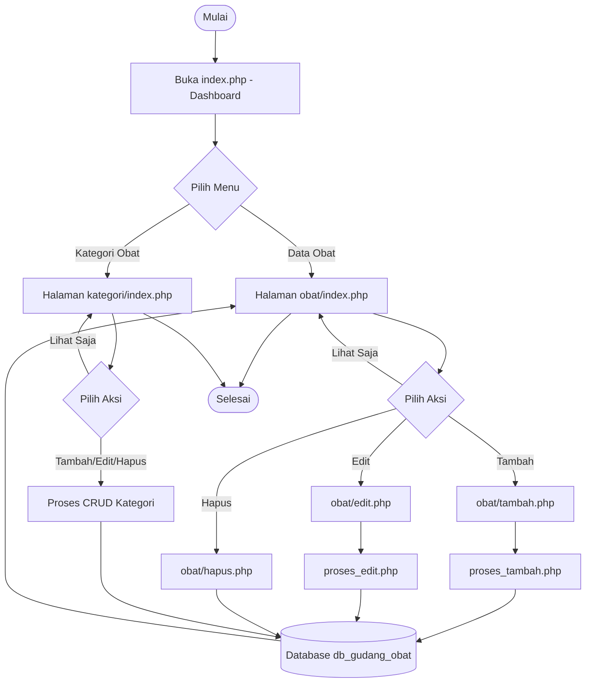

# Planning Aplikasi CRUD Gudang Obat (PHP Native)

Tugas: Aplikasi CRUD sederhana untuk mengelola data obat di gudang, menggunakan PHP native (tanpa framework), untuk latihan siswa kelas 11 RPL.

---

## 1. Deskripsi Aplikasi

Aplikasi ini digunakan untuk mencatat data obat yang ada di gudang, meliputi:
- Menambah data obat baru
- Melihat daftar obat
- Mengubah (edit) data obat
- Menghapus data obat
- Mengelola kategori obat (Tablet, Sirup, Kapsul, dll)

---

## 2. Struktur Database — `database_obat.sql`

```sql
-- membuat database
CREATE DATABASE IF NOT EXISTS db_gudang_obat;
USE db_gudang_obat;

-- tabel kategori obat
CREATE TABLE kategori (
    id_kategori INT(11) NOT NULL AUTO_INCREMENT,
    nama_kategori VARCHAR(50) NOT NULL,
    PRIMARY KEY (id_kategori)
) ENGINE=InnoDB DEFAULT CHARSET=utf8mb4;

-- tabel obat
CREATE TABLE obat (
    id_obat INT(11) NOT NULL AUTO_INCREMENT,
    kode_obat VARCHAR(20) NOT NULL,
    nama_obat VARCHAR(100) NOT NULL,
    id_kategori INT(11) NOT NULL,
    satuan VARCHAR(20) NOT NULL,
    stok INT(11) NOT NULL DEFAULT 0,
    harga_satuan DECIMAL(10,2) NOT NULL DEFAULT 0,
    tanggal_masuk DATE NOT NULL,
    keterangan TEXT,
    PRIMARY KEY (id_obat),
    UNIQUE KEY kode_obat (kode_obat),
    FOREIGN KEY (id_kategori) REFERENCES kategori(id_kategori)
        ON UPDATE CASCADE
        ON DELETE RESTRICT
) ENGINE=InnoDB DEFAULT CHARSET=utf8mb4;

-- data awal kategori
INSERT INTO kategori (nama_kategori) VALUES
('Tablet'),
('Sirup'),
('Kapsul'),
('Salep'),
('Injeksi');

-- contoh data obat
INSERT INTO obat (kode_obat, nama_obat, id_kategori, satuan, stok, harga_satuan, tanggal_masuk, keterangan) VALUES
('OB001', 'Paracetamol 500mg', 1, 'Box', 50, 15000, '2026-09-01', 'Obat penurun panas'),
('OB002', 'OBH Combi', 2, 'Botol', 30, 12000, '2026-09-01', 'Obat batuk');
```

**Catatan:**
- Tabel `kategori` dan `obat` dihubungkan dengan relasi *one-to-many* (satu kategori bisa punya banyak obat) lewat `id_kategori`.
- Siswa bisa menambahkan tabel `supplier` sebagai pengembangan jika waktu memungkinkan.

---

## 3. Struktur File dan Folder

```
gudang-obat/
├── config/
│   └── koneksi.php          # koneksi ke database (mysqli/PDO)
│
├── obat/
│   ├── index.php             # menampilkan daftar obat
│   ├── tambah.php            # form tambah obat
│   ├── proses_tambah.php     # proses simpan data baru
│   ├── edit.php               # form edit obat
│   ├── proses_edit.php       # proses update data
│   └── hapus.php              # proses hapus data
│
├── kategori/
│   ├── index.php             # daftar kategori
│   ├── tambah.php            # form tambah kategori
│   ├── edit.php               # form edit kategori
│   └── hapus.php              # proses hapus kategori
│
├── template/
│   ├── header.php            # bagian atas halaman (navbar, dsb)
│   └── footer.php            # bagian bawah halaman
│
├── assets/
│   ├── css/                  # custom css (opsional, selain Bootstrap CDN)
│   ├── js/                   # custom javascript
│   └── img/                  # gambar/logo
│
├── database_obat.sql         # file export database
└── index.php                  # halaman dashboard / beranda
```

**Catatan:**
- `config/koneksi.php` cukup di-`include`/`require` di setiap file yang butuh akses database.
- `template/header.php` dan `footer.php` di-*include* di setiap halaman agar tampilan (Bootstrap navbar, dsb) konsisten dan tidak menulis ulang kode HTML yang sama.

---

## 4. Flowchart Alur Aplikasi



**Alur singkat:**
1. User membuka dashboard (`index.php`).
2. User memilih mau kelola **Data Obat** atau **Kategori Obat**.
3. Setiap menu punya 4 aksi dasar CRUD: **Create** (tambah), **Read** (lihat), **Update** (edit), **Delete** (hapus).
4. Semua aksi Create/Update/Delete berakhir di database, lalu kembali menampilkan daftar data terbaru.

---

## 5. Saran Langkah Pengerjaan untuk Siswa

1. Import `database_obat.sql` ke phpMyAdmin/MySQL.
2. Buat `config/koneksi.php` menggunakan `mysqli_connect()` atau PDO.
3. Buat `template/header.php` & `footer.php` berisi Bootstrap CDN.
4. Kerjakan modul **obat** dulu (CRUD paling utama), baru **kategori**.
5. Gunakan **prepared statement** (`mysqli_prepare` / PDO `bindParam`) supaya terhindar dari SQL Injection.
6. Tambahkan validasi input sederhana (misal: stok tidak boleh minus, kode obat tidak boleh kosong).
